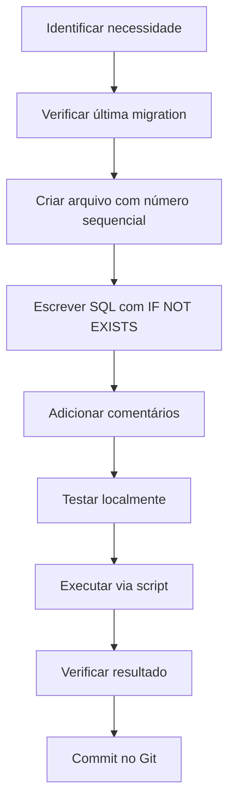

# 📚 Guia de Migrations - Modificações no Banco de Dados

Este documento explica o processo completo de modificações no banco de dados, desde a criação de uma migration até sua execução em diferentes ambientes.

---

## 📋 Índice

1. [O que são Migrations?](#o-que-são-migrations)
2. [Estrutura de Nomenclatura](#estrutura-de-nomenclatura)
3. [Criando uma Migration](#criando-uma-migration)
4. [Executando Migrations](#executando-migrations)
5. [Boas Práticas](#boas-práticas)
6. [Exemplos Práticos](#exemplos-práticos)
7. [Troubleshooting](#troubleshooting)

---

## 🎯 O que são Migrations?

**Migrations** são scripts SQL que descrevem mudanças incrementais no esquema do banco de dados. Elas permitem:

- ✅ Versionar mudanças no banco de dados
- ✅ Aplicar alterações de forma controlada e reversível
- ✅ Manter sincronização entre ambientes (dev, staging, produção)
- ✅ Documentar histórico de mudanças

### 📁 Localização

Todas as migrations ficam em:
```
database/migrations/
```

---

## 📝 Estrutura de Nomenclatura

### Padrão de Nomenclatura

```
NNN_descricao_da_migration.sql
```

Onde:
- **NNN**: Número sequencial com 3 dígitos (001, 002, 003, ...)
- **descricao_da_migration**: Descrição em snake_case do que a migration faz

### Exemplos

```
001_schema.sql
002_cursos_turmas.sql
003_add_auditoria.sql
007_add_expiration_date.sql
010_rename_professor_to_docente.sql
011_add_participou_edital_ganhou_premio.sql
```

### ⚠️ Importante

- **Sempre use números sequenciais** (não pule números)
- Use **snake_case** para a descrição
- Seja **descritivo** no nome (deixe claro o que a migration faz)

---

## ✍️ Criando uma Migration

### Passo 1: Escolher o Número da Migration

Verifique qual é a última migration criada:

```bash
ls -la database/migrations/ | grep -E "^[0-9]{3}_"
```

O próximo número será o último + 1.

### Passo 2: Criar o Arquivo

Crie um novo arquivo seguindo o padrão:

```bash
touch database/migrations/XXX_nome_da_migration.sql
```

Substitua `XXX` pelo número sequencial e `nome_da_migration` pela descrição.

### Passo 3: Estrutura Básica da Migration

Toda migration deve seguir este template:

```sql
-- ============================================================================
-- MIGRATION: XXX_nome_da_migration
-- DATA: YYYY-MM-DD
-- DESCRIÇÃO: Descrição detalhada do que esta migration faz
-- ============================================================================

-- Seus comandos SQL aqui
ALTER TABLE nome_tabela
  ADD COLUMN IF NOT EXISTS novo_campo TIPO DEFAULT valor_padrao;

COMMENT ON COLUMN nome_tabela.novo_campo IS 'Descrição do campo';
```

### Passo 4: Escrever os Comandos SQL

#### ✅ Boas Práticas ao Escrever SQL

1. **Use `IF NOT EXISTS`** para evitar erros se a migration já foi executada:
   ```sql
   ADD COLUMN IF NOT EXISTS campo BOOLEAN DEFAULT FALSE
   ```

2. **Sempre defina valores padrão** para novos campos:
   ```sql
   ADD COLUMN IF NOT EXISTS ativo BOOLEAN DEFAULT TRUE
   ```

3. **Adicione comentários** para documentar campos:
   ```sql
   COMMENT ON COLUMN tabela.campo IS 'Descrição do que este campo armazena';
   ```

4. **Use transações** para operações complexas (opcional):
   ```sql
   BEGIN;
   -- comandos SQL
   COMMIT;
   ```

5. **Evite `DROP` sem backup** - migrations devem ser aditivas quando possível

---

## 🚀 Executando Migrations

### Opção 1: Executar uma Migration Específica (Recomendado)

Para executar apenas uma migration específica:

```bash
./scripts/setup-db.sh single database/migrations/011_add_participou_edital_ganhou_premio.sql
```

**Vantagens:**
- ✅ Executa apenas a migration desejada
- ✅ Mais rápido
- ✅ Ideal para desenvolvimento

### Opção 2: Executar Todas as Migrations

Para executar todas as migrations em sequência:

```bash
./scripts/setup-db.sh migration
```

**Quando usar:**
- Setup inicial do banco
- Após clonar o repositório
- Quando precisa garantir que todas as migrations estão aplicadas

### Opção 3: Executar via Docker (Manual)

Se preferir executar manualmente:

```bash
# 1. Copiar arquivo para o container
docker compose cp database/migrations/011_add_participou_edital_ganhou_premio.sql vitrine-senai-db:/tmp/011_add_participou_edital_ganhou_premio.sql

# 2. Executar a migration
docker compose exec vitrine-senai-db psql -U postgres -d vitrine_projetos -f /tmp/011_add_participou_edital_ganhou_premio.sql
```

### Opção 4: Executar Diretamente via psql (Banco Local)

Se o banco estiver rodando localmente (não em Docker):

```bash
psql -U postgres -d vitrine_projetos -f database/migrations/011_add_participou_edital_ganhou_premio.sql
```

### ⚠️ Pré-requisitos

Antes de executar qualquer migration, certifique-se de que:

1. **O container do banco está rodando:**
   ```bash
   docker compose ps
   ```

2. **Se não estiver, inicie o container:**
   ```bash
   docker compose up -d vitrine-senai-db
   ```

3. **Verifique a conexão:**
   ```bash
   docker compose exec vitrine-senai-db psql -U postgres -d vitrine_projetos -c "SELECT version();"
   ```

---

## 📚 Exemplos Práticos

### Exemplo 1: Adicionar Campos em uma Tabela

**Cenário:** Adicionar campos `participou_edital` e `ganhou_premio` na tabela `projetos`.

**Arquivo:** `011_add_participou_edital_ganhou_premio.sql`

```sql
-- ============================================================================
-- MIGRATION: 011_add_participou_edital_ganhou_premio
-- DATA: 2025-01-XX
-- DESCRIÇÃO: Adiciona campos participou_edital e ganhou_premio na tabela projetos
-- ============================================================================

ALTER TABLE projetos
  ADD COLUMN IF NOT EXISTS participou_edital BOOLEAN DEFAULT FALSE,
  ADD COLUMN IF NOT EXISTS ganhou_premio BOOLEAN DEFAULT FALSE;

COMMENT ON COLUMN projetos.participou_edital IS 'Indica se o projeto participou de algum edital';
COMMENT ON COLUMN projetos.ganhou_premio IS 'Indica se o projeto ganhou algum prêmio';
```

**Executar:**
```bash
./scripts/setup-db.sh single database/migrations/011_add_participou_edital_ganhou_premio.sql
```

### Exemplo 2: Adicionar Campo com Timestamp

**Cenário:** Adicionar campo `data_expiracao` na tabela `noticias`.

**Arquivo:** `007_add_expiration_date.sql`

```sql
-- ============================================================================
-- MIGRATION: 007_add_expiration_date
-- DATA: 2025-12-14
-- DESCRIÇÃO: Adiciona campo data_expiracao para agendamento de arquivamento
-- ============================================================================
ALTER TABLE noticias
ADD COLUMN IF NOT EXISTS data_expiracao TIMESTAMP;
COMMENT ON COLUMN noticias.data_expiracao IS 'Data agendada para arquivamento automático da notícia';
```

### Exemplo 3: Renomear Tabelas e Colunas

**Cenário:** Renomear tabela `professores` para `docentes`.

**Arquivo:** `010_rename_professor_to_docente.sql`

```sql
-- ============================================================================
-- MIGRATION: 010_rename_professor_to_docente
-- DATA: 2025-XX-XX
-- DESCRIÇÃO: Renomeia referências de professor para docente
-- ============================================================================

-- Renomear tabela
ALTER TABLE IF EXISTS professores RENAME TO docentes;

-- Renomear tabela de relacionamento
ALTER TABLE IF EXISTS projetos_professores RENAME TO projetos_docentes;

-- Atualizar constraints
ALTER TABLE usuarios DROP CONSTRAINT IF EXISTS usuarios_tipo_check;
ALTER TABLE usuarios ADD CONSTRAINT usuarios_tipo_check 
  CHECK (tipo::text = ANY (ARRAY['ADMIN'::character varying, 'ALUNO'::character varying, 'DOCENTE'::character varying]::text[]));
```

### Exemplo 4: Criar Nova Tabela

**Cenário:** Criar tabela `projetos_fases`.

```sql
-- ============================================================================
-- MIGRATION: 012_create_projetos_fases
-- DATA: 2025-XX-XX
-- DESCRIÇÃO: Cria tabela para armazenar fases dos projetos
-- ============================================================================

CREATE TABLE IF NOT EXISTS projetos_fases (
  uuid UUID PRIMARY KEY DEFAULT gen_random_uuid(),
  projeto_uuid UUID NOT NULL REFERENCES projetos(uuid) ON DELETE CASCADE,
  fase VARCHAR(50) NOT NULL CHECK (fase IN ('IDEACAO', 'MODELAGEM', 'PROTOTIPAGEM', 'IMPLEMENTACAO')),
  descricao TEXT,
  criado_em TIMESTAMP DEFAULT NOW(),
  atualizado_em TIMESTAMP DEFAULT NOW()
);

CREATE INDEX IF NOT EXISTS idx_projetos_fases_projeto ON projetos_fases(projeto_uuid);

COMMENT ON TABLE projetos_fases IS 'Armazena descrições das fases do projeto';
COMMENT ON COLUMN projetos_fases.fase IS 'Fase do projeto: IDEACAO, MODELAGEM, PROTOTIPAGEM ou IMPLEMENTACAO';
```

---

## ✅ Boas Práticas

### 1. **Sempre Use `IF NOT EXISTS`**

```sql
-- ✅ BOM
ADD COLUMN IF NOT EXISTS campo BOOLEAN DEFAULT FALSE

-- ❌ RUIM
ADD COLUMN campo BOOLEAN DEFAULT FALSE
```

### 2. **Defina Valores Padrão**

```sql
-- ✅ BOM
ADD COLUMN IF NOT EXISTS ativo BOOLEAN DEFAULT TRUE

-- ❌ RUIM (pode causar problemas com dados existentes)
ADD COLUMN IF NOT EXISTS ativo BOOLEAN
```

### 3. **Adicione Comentários**

```sql
-- ✅ BOM
COMMENT ON COLUMN projetos.participou_edital IS 'Indica se o projeto participou de algum edital';

-- ❌ RUIM (sem documentação)
-- Campo sem comentário
```

### 4. **Use Transações para Operações Complexas**

```sql
BEGIN;

ALTER TABLE tabela1 ADD COLUMN campo1 VARCHAR(100);
ALTER TABLE tabela2 ADD COLUMN campo2 VARCHAR(100);
UPDATE tabela1 SET campo1 = 'valor' WHERE id = 1;

COMMIT;
```

### 5. **Teste em Ambiente de Desenvolvimento Primeiro**

Sempre teste a migration em desenvolvimento antes de aplicar em produção.

### 6. **Mantenha Migrations Pequenas e Focadas**

Uma migration deve fazer uma coisa bem feita. Se precisar fazer várias mudanças relacionadas, considere criar migrations separadas.

### 7. **Documente Mudanças Importantes**

Se a migration faz algo não óbvio, adicione comentários explicativos:

```sql
-- IMPORTANTE: Esta migration atualiza todos os registros existentes
-- para garantir compatibilidade com o novo formato
UPDATE tabela SET campo = 'novo_formato' WHERE campo IS NULL;
```

---

## 🔧 Troubleshooting

### Problema: "Container do banco não está rodando"

**Solução:**
```bash
docker compose up -d vitrine-senai-db
```

### Problema: "column already exists"

**Causa:** A migration já foi executada anteriormente.

**Solução:** 
- Se você usou `IF NOT EXISTS`, o erro é apenas um aviso e pode ser ignorado
- Se não usou, adicione `IF NOT EXISTS` na migration

### Problema: "relation does not exist"

**Causa:** Tentando modificar uma tabela que não existe.

**Solução:**
```sql
-- Use IF EXISTS para evitar erro
ALTER TABLE IF EXISTS tabela_inexistente ADD COLUMN campo VARCHAR(100);
```

### Problema: "permission denied"

**Causa:** Usuário do banco não tem permissões suficientes.

**Solução:**
```bash
# Verificar usuário atual
docker compose exec vitrine-senai-db psql -U postgres -d vitrine_projetos -c "SELECT current_user;"

# Se necessário, executar como superusuário
docker compose exec vitrine-senai-db psql -U postgres -d vitrine_projetos -f /tmp/migration.sql
```

### Problema: "syntax error"

**Causa:** Erro de sintaxe SQL na migration.

**Solução:**
1. Revise a sintaxe SQL
2. Teste o comando diretamente no psql antes de criar a migration
3. Use um validador SQL online se necessário

### Verificar se Migration foi Aplicada

```bash
# Verificar se coluna existe
docker compose exec vitrine-senai-db psql -U postgres -d vitrine_projetos -c "\d projetos"

# Ou verificar via SQL
docker compose exec vitrine-senai-db psql -U postgres -d vitrine_projetos -c "
SELECT column_name, data_type, column_default 
FROM information_schema.columns 
WHERE table_name = 'projetos' 
  AND column_name IN ('participou_edital', 'ganhou_premio');
"
```

---

## 📋 Checklist de Criação de Migration

Antes de considerar uma migration completa, verifique:

- [ ] Nome do arquivo segue o padrão `NNN_descricao.sql`
- [ ] Número sequencial está correto (não pula números)
- [ ] Cabeçalho com MIGRATION, DATA e DESCRIÇÃO está preenchido
- [ ] Usa `IF NOT EXISTS` / `IF EXISTS` quando apropriado
- [ ] Define valores padrão para novos campos
- [ ] Adiciona comentários (`COMMENT ON`) para novos campos/tabelas
- [ ] Testou a migration em ambiente de desenvolvimento
- [ ] Migration é idempotente (pode ser executada múltiplas vezes sem erro)
- [ ] Documentou mudanças importantes nos comentários

---

## 🔄 Fluxo Completo: Resumo



### Passo a Passo Rápido

1. **Identificar mudança necessária**
2. **Verificar última migration:** `ls database/migrations/ | tail -1`
3. **Criar arquivo:** `touch database/migrations/XXX_descricao.sql`
4. **Escrever SQL** seguindo o template
5. **Testar:** `./scripts/setup-db.sh single database/migrations/XXX_descricao.sql`
6. **Verificar:** Confirmar que a mudança foi aplicada
7. **Commit:** Adicionar ao controle de versão

---

## 📞 Suporte

Se encontrar problemas ou tiver dúvidas:

1. Verifique este documento primeiro
2. Consulte migrations anteriores como referência
3. Verifique os logs do container: `docker compose logs vitrine-senai-db`
4. Teste comandos SQL diretamente no psql antes de criar a migration

---

**Última atualização:** 2025-01-XX  
**Versão:** 1.0

